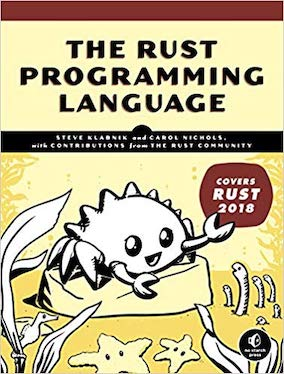
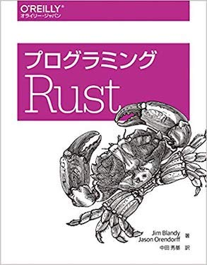

layout: true
class: middle
---
class: center
# Some Learning Materials
---
# Rust Training@London Slides
https://ferrous-systems.github.io/teaching-material/index.html
---
.left-column[
## The Book
https://doc.rust-lang.org/book/

]

.right-column[
## プログラミング Rust

]
---
## Oreilly Subscription
[年99ドルでオライリーの英語技術書を読み放題にする方法](https://qiita.com/wawoon/items/bc8a00a7549ca8586cda)
---
# Hands On
- #### [A half-hour to learn Rust](https://fasterthanli.me/blog/2020/a-half-hour-to-learn-rust/)
基本的な文法からGenerics/Trait等ちょっと高度な話題までひととおり学べるチュートリアル。  
30分では終わりません。

- #### [Exercism](https://exercism.io/my/tracks/rust)
プログラミングクイズ  
```sh
exercism download --exercise=grains --track=rust
```
- #### [rustlings](https://github.com/rust-lang/rustlings)
コンパイルエラーをひたすらなおす。
---
# Internal Resources
- ### [Slack #rust](https://fastly.slack.com/archives/C171HMLTB)
- ### [Slack #rust-learning](https://fastly.slack.com/archives/CQW3346AZ)
- ### [Learning Rust At Fastly](https://docs.google.com/document/d/1YoYmMB_ygyhLIzegCt_G3YeiyLZoCWKDZ0j2_sEwzn4/edit)
---
# Other Links
- #### [Learn Rust](https://www.rust-lang.org/learn)
- #### [Rust by Example](https://doc.rust-lang.org/stable/rust-by-example/)
- #### [Rust Language Cheat Sheet](https://cheats.rs/)
- #### [Rust Cookbook](https://rust-lang-nursery.github.io/rust-cookbook/)
- #### [Rust and WebAssembly](https://rustwasm.github.io/docs/book/)
- #### [Rust Playground](https://play.rust-lang.org/)
---
# Getting Started
https://www.rust-lang.org/learn/get-started

```sh
cargo new hello-rust
     Created binary (application) `hello-rust` package
cd hello-rust
tree
.
|── Cargo.toml
└── src
    └── main.rs
```
---
Cargo.toml
```rust
[package]
name = "hello-rust"
version = "0.1.0"
authors = ["hrmsk66 <hrmsk66@gmail.com>"]
edition = "2018"

# See more keys and their definitions at https://doc.rust-lang.org/cargo/reference/manifest.html

[dependencies]
```

src/main.rs
```rust
fn main() {
    println!("Hello, world!");
}
```
---
# IDE  
https://areweideyet.com/
---
# Fizz Buzz in Rust (1)
https://play.rust-lang.org/?version=stable&mode=debug&edition=2018&gist=e122204c64b22034a40ffddd1df4142e
```rust
fn main() {
    for n in 0..100 {
        println!("{}", fizzbuzz(n));
    }
}

fn fizzbuzz(n: i32) -> String {
    if n % 3 == 0 && n % 5 == 0 {
        "fizzbuzz".to_string()
    } else if n % 3 == 0 {
        "fizz".to_string()
    } else if n % 5 == 0 {
        "buzz".to_string()
    } else {
        n.to_string()
    }
}
```
---
# Fizz Buzz in Rust (2)
fizzbuzz() のなかの処理は O'reillyの本に載ってたもの。  
https://play.rust-lang.org/?version=stable&mode=debug&edition=2018&gist=22363c26812c27bdfcf90bab09d68ece
```rust
use std::iter::{once, repeat};

fn main() {
    for line in fizzbuzz(100) {
        println!("{}", line);
    }
}

fn fizzbuzz(n: i32) -> impl Iterator<Item = String> {
    let f = repeat("").take(2).chain(once("fizz")).cycle();
    let b = repeat("").take(4).chain(once("buzz")).cycle();
    let fb = f.zip(b);
    
    (1..n).zip(fb).map(|tuple| match tuple {
        (i, ("", "")) => i.to_string(),
        (_, (fizz, buzz)) => format!("{}{}", fizz, buzz),
    })
}
```
